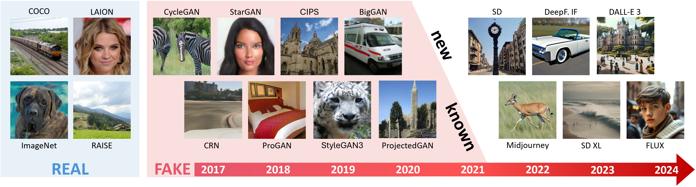

# AI-GenBench: A New Ongoing Benchmark for AI-Generated Image Detection

This is the official repository of the AI-GenBench benchmark, a new benchmark for the detection of AI-generated images.

**New paper out: [Generalized Design Choices for Deepfake Detectors](https://arxiv.org/abs/2511.21507)** on **[arXiv](https://arxiv.org/abs/2511.21507)**!

Resources:
- [**🌐 Official Website of AI-GenBench**](https://mi-biolab.github.io/aigenbench-website/)
  - Includes the leaderboard of top-performing detection approaches!
- [**📜 AI-GenBench: A New Ongoing Benchmark for AI-Generated Image Detection**](https://arxiv.org/abs/2504.20865)\
*Lorenzo Pellegrini, Davide Cozzolino, Serafino Pandolfini, Davide Maltoni, Matteo Ferrara, Luisa Verdoliva, Marco Prati, Marco Ramilli*\
[Verimedia](https://verimediaijcnn2025.github.io/workshop.website/index.html) @ [IJCNN 2025](https://2025.ijcnn.org/)\
[](https://doi.org/10.1109/IJCNN64981.2025.11228377) 
[](https://arxiv.org/abs/2504.20865)
- [ **📜🆕 Generalized Design Choices for Deepfake Detectors**](https://arxiv.org/abs/2511.21507)\
*Lorenzo Pellegrini, Serafino Pandolfini, Davide Maltoni, Matteo Ferrara, Marco Prati, Marco Ramilli*\
[](https://arxiv.org/abs/2511.21507)



Unlike existing solutions that evaluate models on static datasets, AI-GenBench introduces a **temporal evaluation framework** where detection methods are incrementally trained on synthetic images, historically ordered by their generative models, to **test their ability to generalize to new generative models**, such as the transition from GANs to diffusion models.

The goal of AI-GenBench is to provide:
- a **benchmark protocol** used to evaluate the ability of detection models to detect images generated using both past and future generation techniques.
- the related **training and evaluation datasets** encompassing a wide variety of image generators released in the last 7 years (2017-2024), from **older GANs** to the most recent **diffusion approaches**.
- a framework to **train and evaluate** detection models on the benchmark, which is based on [PyTorch Lightning](https://lightning.ai/docs/pytorch/stable/).

AI-GenBench is an **on-going benchmark**, which means that we will receive submissions and update the leaderboard over time. Please check the [leaderboard](#leaderboard) section for more information.

In the future, we will also release **new versions** of the benchmark with the goal to cover the latest datasets, conditioning methods, generation techniques, and so on.

## Content
This repository contains the code for:
- Creating the AI-GenBench dataset, a **union of many existing datasets** of both AI-generated and real images
  - For a the complete list of included dataset, see [our paper](https://arxiv.org/abs/2504.20865) and the list found in the [dataset_creation](dataset_creation/README.md) folder.
- Training and evaluating detection models on the AI-GenBench benchmark, using our [Lightning](https://lightning.ai/docs/pytorch/stable/)-based framework you can find in the [training_and_evaluation](training_and_evaluation/README.md) folder.
- 🆕 Running the extensive experiments reported in our paper [Generalized Design Choices for Deepfake Detectors](https://arxiv.org/abs/2504.20865) (also found in [training_and_evaluation](training_and_evaluation/README.md) folder).

## Getting started
  - [How to: build the dataset](dataset_creation/README.md)
  - [How to: train and evaluate detectors](training_and_evaluation/README.md)

## Leaderboard
We maintain a public leaderboard to track the **performance of different detection methods** on the AI-GenBench benchmark. You can find the leaderboard on the [official website](https://mi-biolab.github.io/aigenbench-website/leaderboard/).

You may always submit a new entry to the leaderboard by contacting the authors of the papers!

## License

### Code license
This code is released under the [BSD-3-Clause license](LICENSE).

### Dataset license
The images are obtained from multiple sources. Please check the [dataset_creation/README.md](dataset_creation/README.md) file for more information on the sources. You'll find the list of the datasets websites / repositories and, from there, you will be able to find the license terms for each dataset.

## Citing our work
If you use this benchmark and/or code in your research, please cite our paper(s):

### AI-GenBench: A New Ongoing Benchmark for AI-Generated Image Detection
Where we firstly introduce AI-GenBench.\
Please cite the *proceedings version*:

```bibtex
@INPROCEEDINGS{pellegrini2025aigenbench,
  author={Pellegrini, Lorenzo and Cozzolino, Davide and Pandolfini, Serafino and Maltoni, Davide and Ferrara, Matteo and Verdoliva, Luisa and Prati, Marco and Ramilli, Marco},
  booktitle={2025 International Joint Conference on Neural Networks (IJCNN)}, 
  title={{AI-GenBench: A New Ongoing Benchmark for AI-Generated Image Detection}}, 
  year={2025},
  volume={},
  number={},
  pages={1-9},
  doi={10.1109/IJCNN64981.2025.11228377}
}
```

### Generalized Design Choices for Deepfake Detectors
Where we analyze in depth the design choices for deepfake detectors using the AI-GenBench benchmark.\
Currently *under review*. For the moment, please cite the *arXiv version*:

```bibtex
@ARTICLE{pellegrini2024generalized,
  author={Pellegrini, Lorenzo and Pandolfini, Serafino and Maltoni, Davide and Ferrara, Matteo and Prati, Marco and Ramilli, Marco},
  journal={arXiv preprint arXiv:2511.21507}, 
  title={{Generalized Design Choices for Deepfake Detectors}}, 
  year={2024},
}
```

## Credits
We would like to thank [**identifAI**](https://identifai.net) for their valuable contribution to this project.
